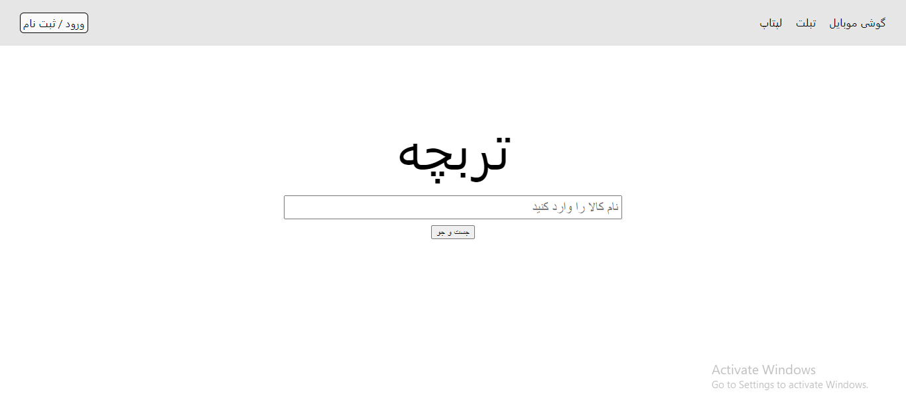
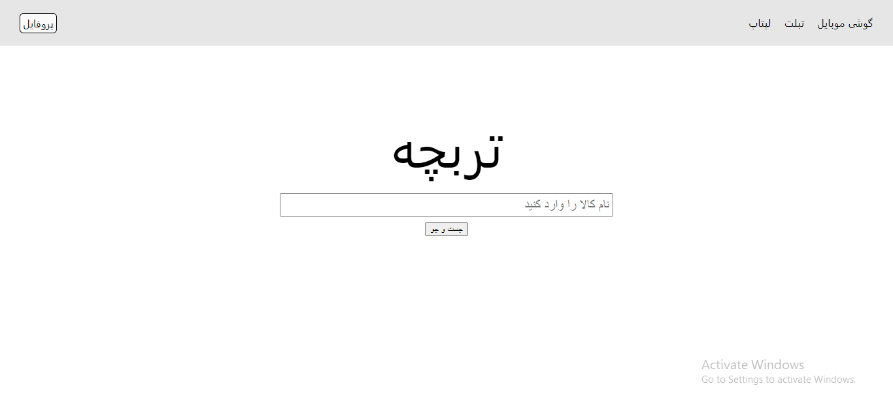
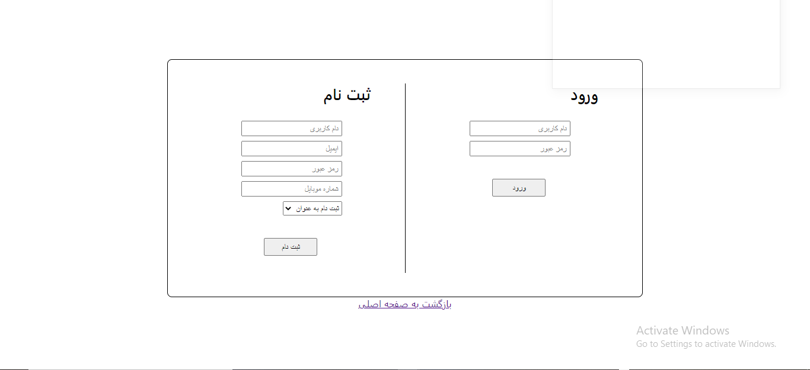
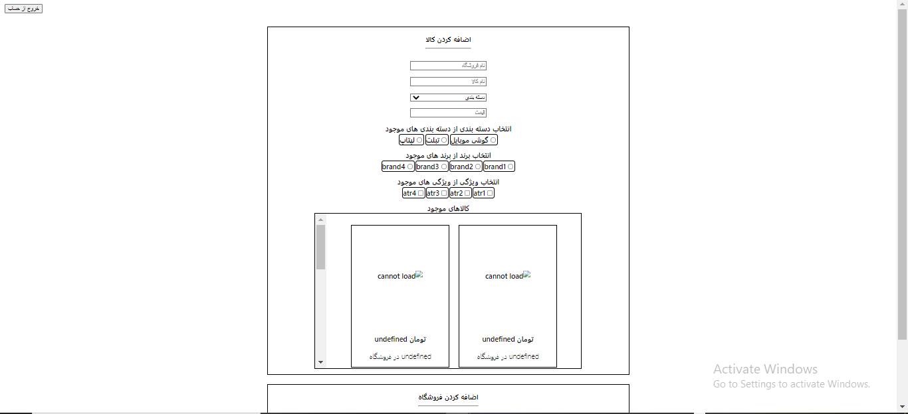
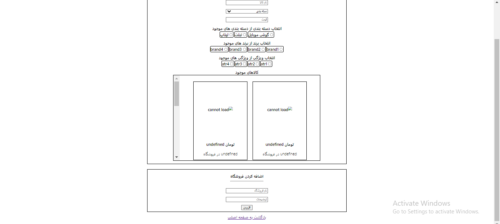
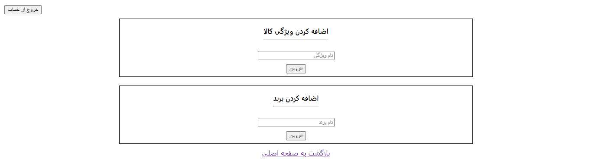
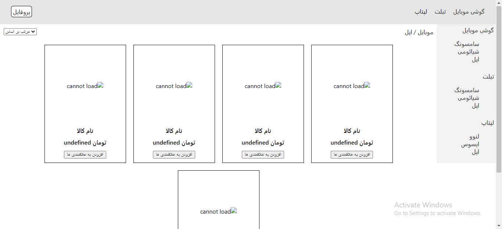

# Torobcheh
<br/>


This is the Internet Engineering course final project in Shahid Beheshti University developed by Mohammad Javad Sahebnasi (frontend) and Morteza Kazemi (backend)   
Summer 2022


<br/>

## 1.Overview


Torobcheh is a platform for E-commerce where different sellers can present their products and users can view the products' details,
shop links, etc. Users can also interract with products in other ways as well. 
Here is the project structure:


```
--- src
       |----- Back-End
       |           |--- config (database and encryption configuration)
       |           |--- helper (some helper functions)
       |           |--- model  (contains all database schemas)
       |           |--- route  (contains all the endpoints)
       |           |--- app.js
       |
       |----- Front-End/torobcheh-front/src
                   |--- public
                   |--- src
                   |      |--- components (react components)
                   |      |        |--- styles (contains css styles)  
                   |      | 
                   |      |--- redux (a local data store)
                   |      |--- App.js (main file)
                   |      |--- index.js
                   |      |--- send_request.js (connection to server)
                   |      |--- setupProxy.js (for when client and server are running on the same host)
                   |       
                   |--- package.json
                   |--- package-lock.json
       
       
```

<br/>

## 2.Description

### 2.1. Frontend

#### main page:



#### main page (after login):



#### login page:



#### vendor profile page:



----------- cont. ------------



#### admin profile page:



#### products list page:



### 2.2. Backend

We used Express.js framework to develop our backend. </br>
We also used mogoose for our database and had the data stored on AWS cloud to make the application data accessible and permanent.
